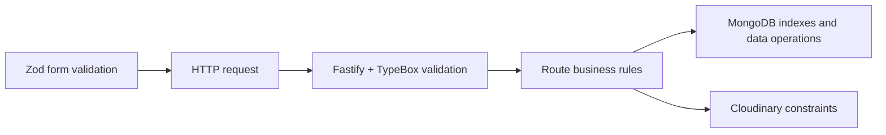

# Data Model, Rules, and Security Boundaries

Prerequisites:

- [Domain concepts and user journeys](01-product-and-user-journeys.md)
- [How web applications work](../00-start-here/01-how-web-apps-work.md)

A **data model** describes which facts the system stores and how those facts relate. A **business rule** states what must be true. A **security boundary** identifies where untrusted data or authority crosses into trusted behavior.

## User Data

The backend's internal `UserRecord` is defined in [`store.ts`](../../apps/api/src/services/store.ts):

| Field | Purpose |
| --- | --- |
| `id` | Stable identity used by sessions and ownership |
| `email` | Login identifier; normalized to lowercase |
| `displayName` | Public attribution |
| `passwordHash` | Argon2 result; never returned to clients |
| `createdAt`, `updatedAt` | Audit and ordering information |

`PublicUserRecord` deliberately omits `passwordHash` and `updatedAt`. Converting internal data into a safe public shape is a security practice, not cosmetic formatting.

## Image Data

An image record joins three concerns:

| Concern | Fields |
| --- | --- |
| Ownership | `ownerId`, `ownerDisplayName` |
| Storage and delivery | `cloudinaryPublicId`, `url`, `width`, `height`, `format`, `bytes` |
| Presentation | `title`, `description`, `altText` |
| Lifecycle | `visibility`, `createdAt`, `updatedAt` |

`cloudinaryPublicId` is internal and omitted from the public `GalleryImage` response. The public URL is safe to display; the Cloudinary public ID is needed for storage management.

`ownerDisplayName` is duplicated into image records. This simplifies gallery reads but means changing a user's display name would not automatically update existing images. This is a **denormalization tradeoff**.

## Business Rules

The implementation enforces these important rules:

1. Public images may be read without authentication.
2. Upload, personal listing, update, and delete require authentication.
3. Only the owner may update or delete an image.
4. Email identity is case-insensitive because emails are normalized before storage.
5. Duplicate email registration is rejected.
6. Passwords must be 8–128 characters at the API schema boundary.
7. Uploads require exactly a file and a non-empty title.
8. Accepted MIME types are JPEG, PNG, and WebP.
9. Maximum file size is 10 MiB.
10. Newly uploaded images are immediately public.
11. API errors use stable codes; the frontend translates them.

The route code is the final authority for request rules. Frontend form rules provide earlier feedback but can be bypassed.

## Validation Layers

Validation occurs at several layers because each catches a different category of problem:



- **Zod:** gives immediate localized browser feedback.
- **TypeBox/Fastify:** rejects malformed JSON and invalid query/path shapes.
- **Route logic:** checks semantic rules such as MIME type and ownership.
- **MongoDB unique index:** prevents duplicate emails even under concurrent requests.
- **Cloudinary:** may reject invalid credentials or upload operations.

No single validation layer replaces the others.

## Trust Boundaries

Treat these as untrusted:

- all browser input;
- cookies until verified;
- uploaded filename and MIME type;
- IDs in URL paths;
- pagination cursors;
- environment variables until configuration checks pass;
- responses and failures from external services.

Important boundaries:

### Browser to API

The browser can be modified or bypassed. The API must enforce every security rule.

### API to MongoDB

The store adapter converts public string IDs into MongoDB `ObjectId` values and rejects invalid IDs by returning `null`.

### API to Cloudinary

Cloudinary credentials stay on the server. The browser never receives the API secret.

### Internal record to public response

Conversion functions such as `toPublicUser` and `toGalleryImage` prevent internal fields from leaking.

## Authentication Versus Authorization

Authentication checks that the JWT identifies a currently existing user. Authorization compares that user with the target image owner.

```text
valid cookie? -> user still exists? -> target exists? -> user owns target?
```

These checks intentionally return different statuses:

- no valid user: `401`;
- target exists but belongs to another user: `403`;
- target does not exist: `404`.

## Consistency Limitation in Upload and Delete

An upload performs two external actions:

1. store bytes in Cloudinary;
2. store metadata in MongoDB.

If Cloudinary succeeds but MongoDB fails, an unused Cloudinary image may remain. Similarly, delete removes Cloudinary first and then MongoDB metadata. There is no distributed transaction across these services.

This is acceptable for a small V1 but is an important advanced limitation. An extension could add compensation logic, cleanup jobs, or an operation state machine.

## Alternative Designs

- Store image bytes inside MongoDB GridFS: fewer vendors, but less specialized image optimization and delivery.
- Store only `ownerId` and look up display name during every gallery read: normalized data, but more query complexity.
- Make errors human-readable on the server: simpler clients, but harder bilingual support.
- Trust only frontend validation: unacceptable because API callers can bypass it.

## Next Step

Continue with [Architecture and repository map](../02-architecture/01-system-map.md).
