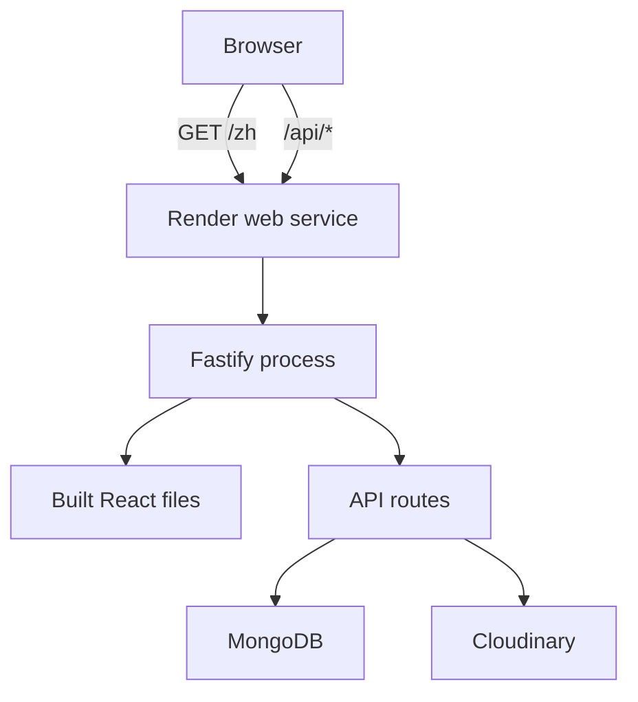
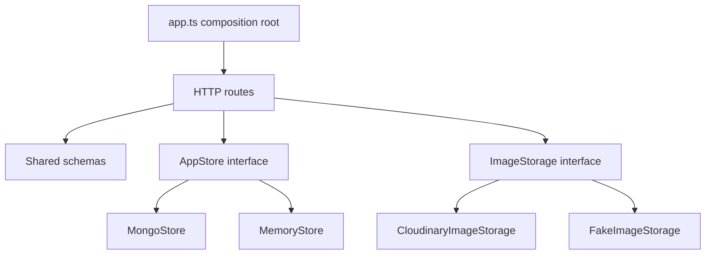
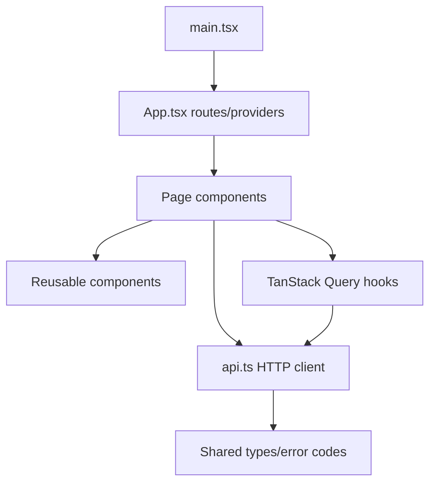

# Architecture and Repository Map

Prerequisites:

- [Node.js, packages, PNPM, and monorepos](../00-start-here/03-node-pnpm-monorepos.md)
- [Data model, rules, and security boundaries](../01-domain/02-data-and-rules.md)

**Architecture** is the system's high-level division of responsibilities and the relationships between those parts.

## Deployment Architecture

In production, Art Museum uses one web service process:

Fastify serves both API responses and built frontend assets. This is a **single-service deployment**. It avoids cross-origin cookie configuration and keeps deployment simple.

Alternative: deploy the frontend to a static host and API separately. That can scale independently but introduces cross-origin resource sharing, separate domains, and more deployment configuration.

## Repository Packages

### `apps/web`

Responsibility: browser experience.

It contains:

- React entry point and routing;
- API client;
- query and mutation state;
- forms and client validation;
- bilingual translations;
- responsive CSS;
- frontend behavior tests.

It must not contain database credentials or direct MongoDB/Cloudinary access.

### `apps/api`

Responsibility: trusted server behavior.

It contains:

- configuration;
- Fastify construction and plugins;
- HTTP routes;
- authentication and authorization;
- storage interfaces and adapters;
- validation/error behavior;
- API integration tests.

### `packages/shared`

Responsibility: shared language between frontend and backend.

It contains:

- locale values;
- stable error codes;
- TypeBox schemas;
- TypeScript types derived from schemas.

It does not contain application state or business workflows.

### `tests/api`

Responsibility: verify the API like an external user over a real TCP port.

Python tests deliberately do not import backend internals. This makes them useful for finding integration problems that in-process tests might miss.

## Layered Backend View

The composition root, [`app.ts`](../../apps/api/src/app.ts), chooses concrete adapters based on configuration. Routes depend on contracts (`AppStore`, `ImageStorage`) rather than directly constructing vendors.

## Layered Frontend View

Pages coordinate user workflows. Components render reusable UI. `api.ts` centralizes network details. TanStack Query tracks server-derived state.

## Entry Points

An **entry point** is where execution begins.

- Browser development entry: [`apps/web/index.html`](../../apps/web/index.html) loads [`main.tsx`](../../apps/web/src/main.tsx).
- API production entry: [`server.ts`](../../apps/api/src/server.ts) creates and listens to the app.
- API test-server entry: [`test-server.ts`](../../apps/api/src/test-server.ts) starts a controlled real server for Python tests.
- CI entry: [`.github/workflows/ci.yml`](../../.github/workflows/ci.yml).
- Render deployment definition: [`render.yaml`](../../render.yaml).

## Important Architectural Patterns

### Application factory

`createApp()` constructs but does not automatically listen. Tests can create isolated app instances and call `app.inject()`. Production calls `listen()` separately.

### Dependency inversion

Routes know what storage can do, not how MongoDB or Cloudinary performs it. See [Contracts, schemas, adapters, and dependency inversion](02-contracts-and-adapters.md).

### Schema-first HTTP routes

Routes declare request and response schemas near handlers. Fastify uses them for validation, serialization, type assistance, and OpenAPI.

### Stable error codes

The API returns codes such as `FILE_TOO_LARGE`; the frontend translates them. This separates transport semantics from language.

### SPA fallback

In production, an unknown non-API path receives `index.html`, allowing React Router to render routes such as `/zh/upload`. Unknown `/api/*` paths stay JSON `404` responses.

## Next Step

Read [Contracts, schemas, adapters, and dependency inversion](02-contracts-and-adapters.md), then [HTTP request lifecycle and data flow](03-request-lifecycle.md).
