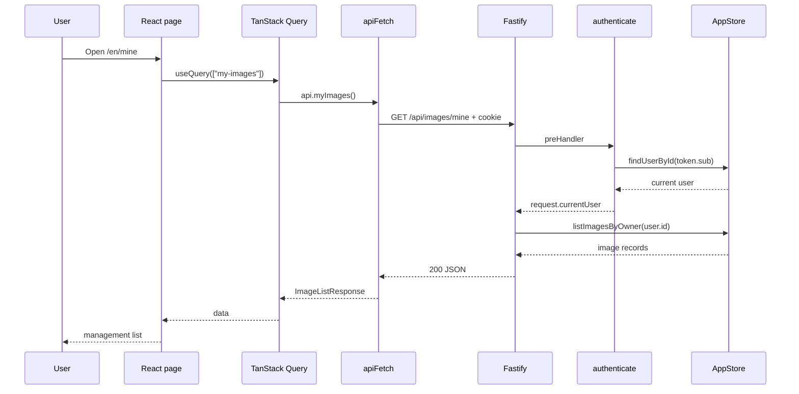

# HTTP Request Lifecycle and Data Flow

Prerequisites:

- [How web applications work](../00-start-here/01-how-web-apps-work.md)
- [Contracts, schemas, adapters, and dependency inversion](02-contracts-and-adapters.md)

This chapter explains what happens from a browser action to a final response. Later walkthroughs apply this model to specific features.

## Browser-to-Server Lifecycle

Consider a logged-in user requesting “My uploads”:



## Backend Startup Before Any Request

Before a request can be handled:

1. [`server.ts`](../../apps/api/src/server.ts) calls `createApp()`.
2. [`config.ts`](../../apps/api/src/config.ts) reads environment configuration.
3. `app.ts` creates Fastify.
4. A store and image-storage adapter are selected.
5. The store initializes; MongoDB connects and creates indexes in production.
6. Plugins register cookies, JWT, multipart handling, rate limiting, Swagger, and routes.
7. `server.ts` calls `listen()` on configured host and port.

Plugin registration order matters. Swagger registers before routes so it can discover their schemas.

## Route Matching and Hooks

Fastify matches method plus path. For `GET /api/images/mine`, it finds the route registered inside `imageRoutes` with `/api` prefix.

The route has `preHandler: app.authenticate`. A **hook** or pre-handler runs before the main handler. If authentication fails, it sends `401` and the handler must not perform protected work.

## Validation and Coercion

For schema-bearing requests, Fastify validates before the handler. The app config enables AJV options:

- `coerceTypes: true`: can convert compatible input text, such as query parameter `"20"`, into number `20`;
- `removeAdditional: "all"`: strips properties not declared in schemas.

Validation errors go to the centralized error handler and become stable API errors.

## Handler and Store

The route handler coordinates business behavior. It does not issue MongoDB operations directly. It calls `app.store`, which may be a Mongo or memory implementation.

The store converts persistence-specific values into application records. The route maps an internal `ImageRecord` into public `GalleryImage`, excluding `cloudinaryPublicId`.

## Response Serialization

The route returns an object. Fastify uses the declared response schema to serialize it. Schema-based serialization can improve performance and prevent undeclared fields from leaking.

The HTTP response crosses the network. `apiFetch` parses JSON, throws `ApiClientError` for failure statuses, or returns data for success.

## Frontend State and Re-rendering

TanStack Query stores server-derived data under a **query key**. When data arrives, React re-renders the component using that data.

After mutations, the frontend invalidates affected keys:

```text
upload -> invalidate ["images"] and ["my-images"]
edit   -> invalidate ["images"] and ["my-images"]
delete -> invalidate ["images"] and ["my-images"]
```

Invalidation tells TanStack Query that cached data may be stale and should be fetched again.

## Error Lifecycle

Example: anonymous upload.

1. Browser sends `POST /api/images` without a valid cookie.
2. `app.authenticate` fails JWT verification.
3. `sendError` sends `401` with `UNAUTHORIZED`.
4. `apiFetch` sees `response.ok === false`.
5. It throws `ApiClientError`.
6. `FormError` translates `errors.UNAUTHORIZED`.

The error code remains stable across languages.

## Static Frontend Request Lifecycle

A request for `/zh/upload` is not an API request:

1. Fastify's API routes do not match.
2. Production not-found handling sees the path does not start with `/api/`.
3. It sends built `index.html`.
4. Browser loads hashed JS and CSS assets.
5. React Router reads `/zh/upload`.
6. `RequireAuth` decides whether to show the upload page or redirect to login.

Hashed assets receive a one-year immutable cache header; HTML must revalidate so it can point to the latest asset names.

## Next Step

Continue with [Fastify application factory and plugins](../03-backend/01-fastify-application.md), then use the [real execution walkthroughs](../README.md#stage-5-trace-real-execution).
