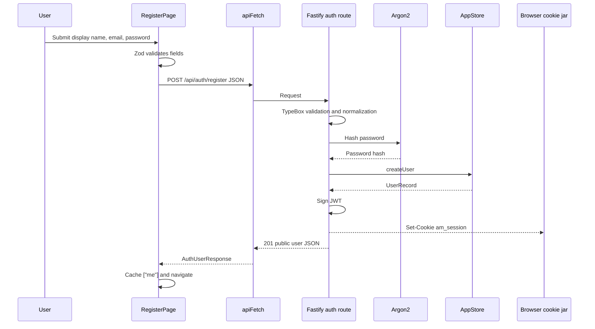

# Registration and Login Walkthrough

Prerequisites:

- [Authentication and authorization](../03-backend/02-authentication-authorization.md)
- [React, routing, server state, and API calls](../04-frontend/01-react-routing-state.md)

This walkthrough traces real execution rather than describing modules separately.

## Registration: Browser to Database and Back

## Step 1: Form Validation

[`RegisterPage.tsx`](../../apps/web/src/pages/RegisterPage.tsx) builds a Zod schema using translated messages. `handleSubmit` prevents the mutation until the values pass.

Syntax to notice:

- `z.object({...})` creates a schema;
- method chaining such as `.trim().min(2).max(80)` adds constraints;
- `register.mutate(values)` begins asynchronous mutation;
- `onSuccess` runs after a successful promise.

This validation is for user experience. Direct API callers do not pass through it.

## Step 2: API Client

`api.register` in [`api.ts`](../../apps/web/src/api.ts) serializes values with `JSON.stringify` and sends `POST /api/auth/register`.

`apiFetch` adds JSON content type and `credentials: "include"`.

## Step 3: Fastify Schema

The route in [`auth.ts`](../../apps/api/src/routes/auth.ts) declares `RegisterBodySchema` and possible responses. Fastify rejects invalid body shapes before the handler runs.

## Step 4: Normalize and Hash

Email is trimmed and lowercased. Display name is trimmed. The route hashes the password before passing anything to storage.

The route does not pass the plaintext password to `createUser`; it passes `passwordHash`.

## Step 5: Persist and Handle Duplicate Email

The selected `AppStore` creates the record. In production, MongoDB's unique email index may raise duplicate error code `11000`; the adapter converts it to `DuplicateEmailError`; the route converts that to `409 EMAIL_EXISTS`.

This chain translates vendor error -> domain error -> HTTP error.

## Step 6: Create Session

The route signs `{ sub: user.id }`, sets the `am_session` cookie, and returns a public user. `toPublicUser` excludes `passwordHash`.

The browser stores the cookie automatically because the response has `Set-Cookie`.

## Step 7: Frontend Success

Registration stores the returned auth response under query key `["me"]` and navigates to the locale gallery. Components using `useMe()` now render authenticated controls.

## Login Differences

Login follows the same network/session path, but instead of creating a user:

1. normalize email;
2. find user;
3. verify password against hash;
4. return identical `INVALID_CREDENTIALS` for unknown email or wrong password;
5. set a new session cookie.

After login, the frontend invalidates `["images"]` and navigates to the gallery.

## Current-User Check

`useMe()` calls `GET /api/auth/me`. Fastify runs `app.authenticate`, verifies cookie JWT, loads the current user, and returns the public user.

An invalid or absent cookie yields `401`; TanStack Query has retries disabled so it does not repeatedly retry normal anonymous state.

## Logout

1. Header invokes `useLogout`.
2. API sends `POST /api/auth/logout`.
3. Fastify clears the cookie and returns `204`.
4. `apiFetch` handles `204` without attempting JSON parsing.
5. frontend invalidates queries, sets `["me"]` to `null`, and returns to gallery.

## Failure Cases to Trace

- Invalid browser email: Zod blocks request.
- Invalid direct API email: route returns validation error.
- Duplicate normalized email: Mongo index -> `EMAIL_EXISTS`.
- Wrong password: `INVALID_CREDENTIALS`.
- Deleted user with old token: authentication clears cookie and returns `401`.

See [Testing strategy and test syntax](../06-quality/01-testing-strategy.md) for how these paths are verified.
