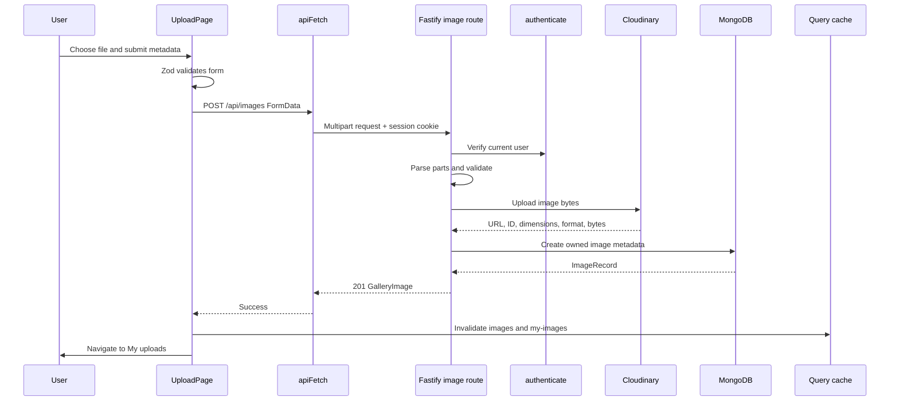

# Upload and Gallery Walkthrough

Prerequisites:

- [Image upload and storage](../03-backend/03-image-upload-storage.md)
- [Forms, bilingual UI, accessibility, and responsive layout](../04-frontend/02-forms-i18n-responsive.md)

## Upload Execution Path

## Step 1: Protected Page

React Router wraps `UploadPage` in `RequireAuth`. This redirects anonymous users, but the API still authenticates independently.

## Step 2: File Input and FormData

The file input's `accept` attribute guides the browser toward JPEG, PNG, and WebP. It is not a security check.

After validation, the page constructs `FormData` with all text fields and one `File`. The browser supplies multipart encoding.

## Step 3: Authentication and Multipart Parsing

The Fastify route's pre-handler verifies the session before costly upload work. `parseUpload` iterates parts and combines file chunks into a bounded Buffer.

The route rejects:

- missing file;
- unsupported MIME type;
- missing title;
- oversized file.

## Step 4: Cloudinary

The route calls the `ImageStorage` contract. Production uses the Cloudinary adapter, which uploads bytes and returns media facts.

The delivery URL includes automatic format and quality settings. This helps browser delivery but does not resize to multiple responsive widths.

## Step 5: MongoDB Metadata

The route uses authenticated user data as ownership source. It does not trust an owner ID submitted by the browser.

MongoDB stores the Cloudinary public ID for future deletion, while the public API returns only the safe gallery fields.

## Step 6: Cache Invalidation

After success, the frontend invalidates both public and personal image queries. It navigates to `/locale/mine`.

Invalidation matters because those cached lists were fetched before the new image existed.

## Public Gallery Read Path

1. `GalleryPage` runs query key `["images"]`.
2. `api.listImages` requests `GET /api/images`.
3. The backend queries public records newest-first.
4. It maps internal records to public `GalleryImage` objects.
5. `GalleryGrid` renders a button per image.
6. CSS column count adapts to viewport width.
7. Each browser image request goes directly to the Cloudinary delivery URL.

Notice the split: Fastify sends metadata JSON; Cloudinary sends image bytes to the browser.

## Lightbox Path

Clicking a tile calls the parent-provided `onSelect(image)`. `GalleryPage` stores the selected image in local React state and conditionally renders `Lightbox`.

No new API request is made because the list response already contains the needed metadata and URL.

The lightbox:

- marks itself as modal dialog;
- shows the full image and metadata;
- closes from button or Escape.

## Error Example: Cloudinary Signature Failure

1. Cloudinary rejects upload with `401 Invalid Signature`.
2. adapter promise rejects;
3. route logs “Image upload storage failure” with error details;
4. route sends `502 STORAGE_FAILURE`;
5. `apiFetch` throws `ApiClientError`;
6. `FormError` shows localized storage failure.

Debug credentials using [Debugging guide](../06-quality/02-debugging-guide.md).

## Performance Considerations

Implemented:

- lazy-loaded gallery images;
- Cloudinary automatic format/quality;
- bounded pages;
- long-lived caching for hashed frontend assets.

Potential future improvements:

- responsive Cloudinary width transformations and `srcset`;
- direct streaming uploads;
- infinite scrolling with `nextCursor`;
- image placeholders;
- limit concurrent heavy uploads.
