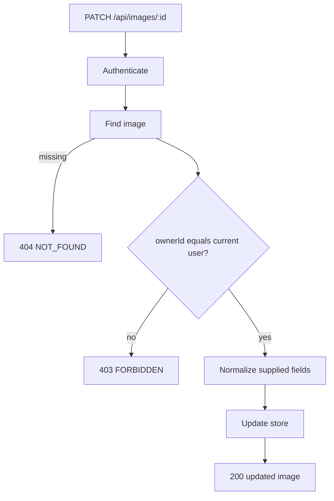

# Edit and Delete Walkthrough

Prerequisites:

- [Authentication and authorization](../03-backend/02-authentication-authorization.md)
- [Upload and gallery walkthrough](02-upload-gallery.md)

## Loading “My Uploads”

`MyUploadsPage` requests `GET /api/images/mine`.

The API:

1. authenticates the cookie;
2. uses `request.currentUser.id`, not a browser-supplied owner ID;
3. queries owned images newest-first;
4. returns public image shapes.

This prevents a user from asking for another user's private management list by changing a query parameter.

## Per-Image Edit Forms

Each `ManageImageItem` creates a React Hook Form initialized from its image:

```ts
defaultValues: {
  title: image.title,
  description: image.description ?? "",
  altText: image.altText ?? ""
}
```

`?? ""` converts nullable API fields into strings suitable for form controls.

Submitting calls:

```text
PATCH /api/images/:id
```

with JSON metadata.

## Backend Patch Path



`normalizeUpdateBody` distinguishes absent fields from supplied empty strings:

- absent optional field: do not update it;
- empty description/alt text: `cleanText` converts to `null`;
- supplied title: trim it.

The TypeBox schema prevents an empty title in normal API validation because `minLength: 1`, though whitespace-only title is a subtle edge case: trimming happens after schema validation and could produce an empty stored title. A future hardening change should explicitly reject it after trimming.

## Why Ownership Check Happens Before Update

The route first reads the image and compares owner IDs. Without this check, any authenticated user who guessed an image ID could update it.

For stronger concurrency safety, ownership could also be included in the database update filter:

```text
update where _id = target AND ownerId = current user
```

That would combine authorization condition and mutation atomically.

## Frontend After Edit

Successful edit invalidates both `["images"]` and `["my-images"]` so public and management views reflect new metadata.

The form itself is not automatically reset from newly fetched values, but its submitted values already match expected update in the normal path.

## Delete Path

The delete button invokes `DELETE /api/images/:id`.

The backend authenticates, finds the target, checks ownership, then:

1. deletes Cloudinary asset using internal `cloudinaryPublicId`;
2. deletes metadata record;
3. returns `204`.

The frontend invalidates both image lists.

## Why Delete Has No JSON Body

`204 No Content` means success with no response representation. `apiFetch` checks status `204` before trying to parse JSON.

## Failure Cases

| Case | Result |
| --- | --- |
| No valid session | `401 UNAUTHORIZED` |
| Target missing/invalid ID | `404 NOT_FOUND` |
| Target belongs to someone else | `403 FORBIDDEN` |
| Cloudinary/storage deletion fails | `502 STORAGE_FAILURE` |
| Target disappears between read and update | `404 NOT_FOUND` |

## Consistency and UX Limitations

- Delete has no confirmation dialog.
- There is no undo.
- Cloudinary and MongoDB deletion are not transactional.
- Concurrent edits use last-write-wins; there is no version check.

Possible extensions include confirmation, soft deletion, operation retries, optimistic concurrency, and audit history. Use [Extension guide](../08-extension/01-extension-guide.md) before changing these workflows.
