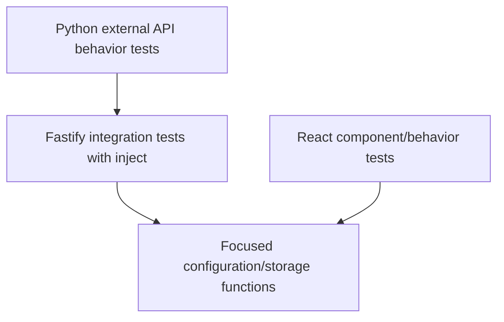

# Testing Strategy and Test Syntax

Prerequisites:

- [HTTP request lifecycle and data flow](../02-architecture/03-request-lifecycle.md)
- [Node.js, packages, PNPM, and monorepos](../00-start-here/03-node-pnpm-monorepos.md)

Testing gathers evidence that behavior remains correct. Different test layers answer different questions; no single layer proves everything.

## Test Pyramid in This Repository



## Vitest Fundamentals

Vitest is the TypeScript test runner.

Common syntax:

```ts
describe("feature", () => {
  it("describes expected behavior", async () => {
    const result = await doSomething();
    expect(result).toBe(expected);
  });
});
```

- `describe` groups related cases;
- `it` defines one behavior;
- `expect` creates an assertion;
- setup hooks prepare/clean state.

A good test name states observable behavior, not implementation detail.

## Backend Fastify Tests

[`app.test.ts`](../../apps/api/src/__tests__/app.test.ts) creates an app with memory store and fake storage.

`app.inject()` simulates an HTTP request inside the process:

```ts
const response = await app.inject({
  method: "GET",
  url: "/api/health"
});
```

Benefits:

- fast;
- no port conflicts;
- exercises Fastify routing, hooks, schemas, cookies, and handlers;
- controlled dependencies.

Limitations:

- does not exercise real TCP networking;
- does not exercise MongoDB or Cloudinary;
- fakes may differ from vendors.

Backend tests cover OpenAPI, production docs gating, cache headers, auth behavior, uploads, and ownership.

## Focused Adapter/Configuration Tests

[`cloudinary-storage.test.ts`](../../apps/api/src/__tests__/cloudinary-storage.test.ts) tests credential precedence and URL parsing without calling Cloudinary.

[`config.test.ts`](../../apps/api/src/__tests__/config.test.ts) tests required configuration behavior.

These are focused because they isolate logic with many error-prone edge cases.

## Frontend Tests

[`App.test.tsx`](../../apps/web/src/App.test.tsx) uses:

- React Testing Library to render and query UI semantically;
- `userEvent` to simulate user actions;
- jsdom to provide a browser-like DOM;
- mocked `fetch` to control API responses.

Queries such as `findByRole("heading", { name: "公共画廊" })` resemble how users and assistive technologies perceive the page. They are preferable to querying private class names.

The tests verify bilingual routes, language switching, lightbox behavior, and upload form validation.

## Python External API Tests

[`tests/api/test_api_behavior.py`](../../tests/api/test_api_behavior.py) starts the compiled API on a free real port and calls it with Python `requests`.

Key syntax:

- `@pytest.fixture(scope="session")`: create shared setup once;
- `yield`: provide the server URL, then run cleanup afterward;
- `requests.Session()`: preserve cookies across requests;
- `assert`: require an expected result.

These tests focus on external user behavior and boundaries:

- registration/login/logout;
- duplicate registration;
- upload validation;
- simulated storage failure;
- public visibility;
- owner-only mutations;
- malformed requests;
- OpenAPI JSON.

Because Python does not import application types, these tests are less likely to accidentally share the same incorrect assumption as backend code.

## Test Doubles

A **test double** replaces a real dependency.

- `MemoryStore` replaces MongoDB.
- `FakeImageStorage` replaces Cloudinary.
- mocked browser `fetch` replaces the API.

Test doubles make tests fast and deterministic. They also create blind spots. Vendor integration should be tested separately in a safe environment when risk requires it.

## Commands and What They Prove

```powershell
pnpm lint
```

Checks configured static code-quality rules. It does not prove runtime correctness.

```powershell
pnpm typecheck
```

Checks TypeScript consistency. It does not validate runtime input or external services.

```powershell
pnpm test
```

Runs shared, backend, and frontend TypeScript tests.

```powershell
pnpm test:api:py
```

Builds shared/API and runs external Python behavior tests.

```powershell
pnpm build
```

Proves production artifacts can be generated.

## Designing Tests for a Change

For each new behavior, ask:

1. What pure/internal rule needs a focused test?
2. What API contract needs an injected Fastify test?
3. What user interaction needs a frontend test?
4. What boundary/error path needs a Python external test?
5. Does the real vendor or deployment need a separate manual/integration check?

## Important Current Gaps

The suite does not directly test:

- real MongoDB adapter behavior;
- real Cloudinary upload/delete;
- cursor pagination across multiple pages;
- focus management in lightbox;
- most edit/delete frontend interactions;
- deployment startup on Render;
- accessibility automation;
- performance/load behavior.

These gaps are not proof of bugs, but they define residual risk.
