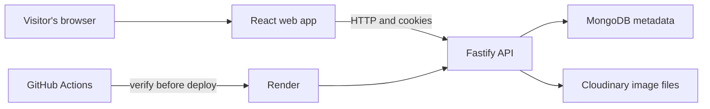

# Art Museum Learning Roadmap

This tutorial system teaches the knowledge needed to understand, run, debug, and extend the Art Museum repository. It assumes you may be new to web development, JavaScript, TypeScript, React, Fastify, databases, testing, and deployment.

Do not begin by reading the source files from top to bottom. Source code is arranged for the computer and maintainers; this roadmap is arranged for a learner. Follow the stages in order and use the linked source files when a tutorial asks you to inspect them.

## What This Repository Builds

Art Museum is a bilingual photography gallery. Visitors can browse public images and enlarge them in a lightbox. Registered users can log in, upload images, and edit or delete only their own uploads.

The browser runs a React application. The React application sends HTTP requests to a Fastify API. Fastify stores user and image metadata in MongoDB and stores image bytes in Cloudinary. In production, one Fastify process also serves the compiled React files. Render runs that process, and GitHub Actions checks changes before deployment.



## Learning Path

### Stage 0: Learn the prerequisites

1. [How web applications work](00-start-here/01-how-web-apps-work.md)
2. [JavaScript and TypeScript from zero](00-start-here/02-javascript-typescript.md)
3. [Node.js, packages, PNPM, and monorepos](00-start-here/03-node-pnpm-monorepos.md)
4. [Repository file formats and command line basics](00-start-here/04-files-and-command-line.md)

### Stage 1: Understand the product

5. [Domain concepts and user journeys](01-domain/01-product-and-user-journeys.md)
6. [Data model, rules, and security boundaries](01-domain/02-data-and-rules.md)

### Stage 2: Understand the system shape

7. [Architecture and repository map](02-architecture/01-system-map.md)
8. [Contracts, schemas, adapters, and dependency inversion](02-architecture/02-contracts-and-adapters.md)
9. [HTTP request lifecycle and data flow](02-architecture/03-request-lifecycle.md)

### Stage 3: Learn the backend

10. [Fastify application factory and plugins](03-backend/01-fastify-application.md)
11. [Authentication and authorization](03-backend/02-authentication-authorization.md)
12. [Image upload and storage](03-backend/03-image-upload-storage.md)
13. [MongoDB, records, indexes, and cursor pagination](03-backend/04-mongodb-pagination.md)
14. [Validation, OpenAPI, errors, and configuration](03-backend/05-contracts-errors-config.md)

### Stage 4: Learn the frontend

15. [React, routing, server state, and API calls](04-frontend/01-react-routing-state.md)
16. [Forms, bilingual UI, accessibility, and responsive layout](04-frontend/02-forms-i18n-responsive.md)

### Stage 5: Trace real execution

17. [Registration and login walkthrough](05-walkthroughs/01-register-login.md)
18. [Upload and gallery walkthrough](05-walkthroughs/02-upload-gallery.md)
19. [Edit and delete walkthrough](05-walkthroughs/03-edit-delete.md)

### Stage 6: Operate and change the system

20. [Testing strategy and test syntax](06-quality/01-testing-strategy.md)
21. [Debugging guide](06-quality/02-debugging-guide.md)
22. [Build, CI, deployment, and production](07-operations/01-build-ci-deploy.md)
23. [Extension guide](08-extension/01-extension-guide.md)
24. [Advanced internals and design tradeoffs](08-extension/02-advanced-internals.md)

### Reference

- [Dependency guide](09-reference/01-dependencies.md)
- [Glossary](09-reference/02-glossary.md)
- [Code map and responsibility index](09-reference/03-code-map.md)

## Suggested Study Method

For each tutorial:

1. Read the prerequisite links first.
2. Run the referenced command or inspect the linked source file.
3. Explain the flow back to yourself without looking.
4. Change one small behavior locally.
5. Run the relevant tests and undo the experiment.

The repository uses relative links such as [`apps/api/src/app.ts`](../apps/api/src/app.ts). These links take you directly from a concept to its implementation.

## Common Commands

Run commands from the repository root:

```powershell
pnpm install
pnpm dev
pnpm lint
pnpm typecheck
pnpm test
pnpm test:api:py
pnpm build
pnpm start
```

Read [Node.js, packages, PNPM, and monorepos](00-start-here/03-node-pnpm-monorepos.md) before using these commands if their purpose is unfamiliar.
